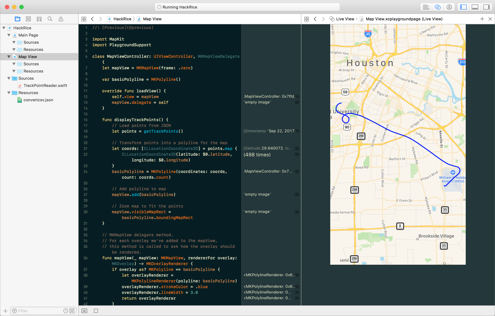

# Hack Rice 2017: ForeFlight Challenge

## Prizes

The winning team will receive Apple Store gift cards!

## Challenge

This repository contains a [JSON file](https://github.com/foreflight/HackRice2017/blob/master/HackRice.playground/Resources/convertcsv.json) that contains the raw data for a track log. The log contains one flight around the Houston area. There are 498 data points, each looking like this:

```json
{
  "timestamp": 1506089531.79418,
  "latitude": 29.640072,
  "longitude": -95.286312,
  "course": 220.429,
  "speed_kts": 0.927796975077,
  "altitude_ft": 44.8205380577427,
  "pressure_altitude_ft": "",
  "source": 1,
  "accuracy_horiz": 1,
  "accuracy_vert": 1,
  "bank": -0.100000001490116,
  "pitch": 0.400000005960464
}
```

Your challenge is to **display** or **interpret** this data in a unique and compelling way. For example:

- Plot the points of the flight in an augmented or virtual reality scene.
- Replay the flight from the pilot's perspective in a virtual reality experience.
- Analyze the data to identify various phases of flight, such as:
    - Takeoff and landing
    - Climb and descent
    - Crashes
    - Maneuvers, such as 360º turns or vertical loops

### Check out the data

This repository contains a Swift playground, which can be opened using Xcode (free, Mac-only). If you don't have a Mac, or just want to work with the data directly, feel free to just use the raw [JSON file](https://github.com/foreflight/HackRice2017/blob/master/HackRice.playground/Resources/convertcsv.json).

1. Install [Xcode from the Mac App Store](https://itunes.apple.com/us/app/xcode/id497799835?mt=12).
1. Download/clone this project.
1. Open `HackRice.playground`.
1. Click through the pages in the project navigator to explore the data set.
1. When you're ready to hack, use the function `getTrackPoints()` to grab an array of `TrackPoint`s containing all the data!



## Workshop

Come to our workshop at 11:00 pm on Friday to see a demo of the Swift playground in action.

## About ForeFlight

Founded in 2007, ForeFlight is devoted to giving pilots the best possible mobile flight planning tools. Check out our [career options for software developers](https://www.foreflight.com/about/careers/)!
